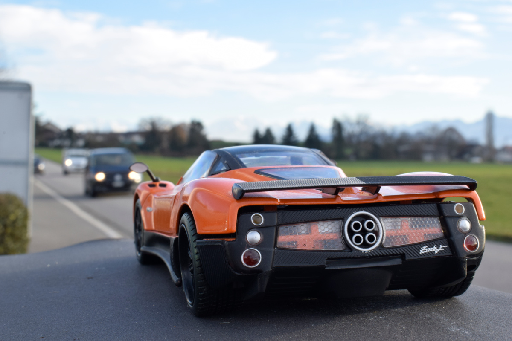

+++
title = "Pagani"
date = "2021-02-17"
draft = false
pinned = false
image = "_blog-gut.jpg"
+++
Der orange Pagani ist scharf zu sehen, der schwarze BMW im Hintergrund ist verschwommen. Dieses Phänomen nennt man Tiefenschärfe. Erkennt ihr eigentlich, welches Auto das richtige ist?

Doch was genau ist die Tiefenschärfe?

Die Tiefenschärfe ist ein Mass für die Ausdehnung des scharfen Bereichs im Objektraum eines abbildenden optischen Systems. Der Begriff beschreibt in der Fotografie eine zentrale Rolle und beschreibt die Grösse des Entfernungsbereichs, innerhalb dessen ein Objekt hinlänglich scharf abgebildet wird. 

Wer Lust hat selbst ein solches Foto zu machen, hier folgende Tipps:

Eine kleine Blendenöffnung z.B. F22 ergibt eine lange Tiefenschärfe. Eine grosse Blendenöffnung z.B. F2,8 ergibt eine kurze Tiefenschärfe. 

Also zusammenfassend:

Je grösser die Blendenöffnung ist, desto verschwommener der Gegenstand im Hintergrund!

Hier unten sind nun Bilder, wo die Tiefenschärfe sehr gut sichtbar ist.

Viel Spass beim ausprobieren!